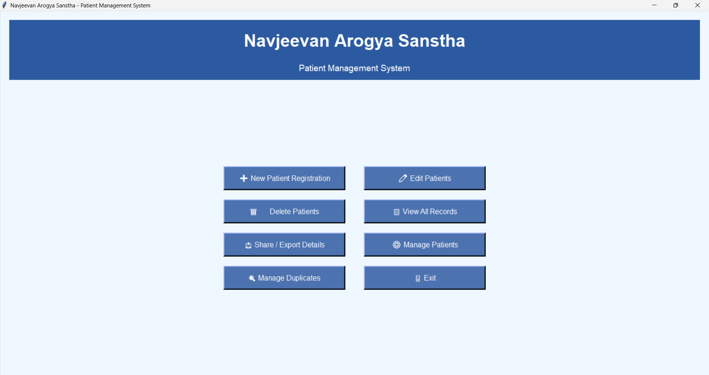
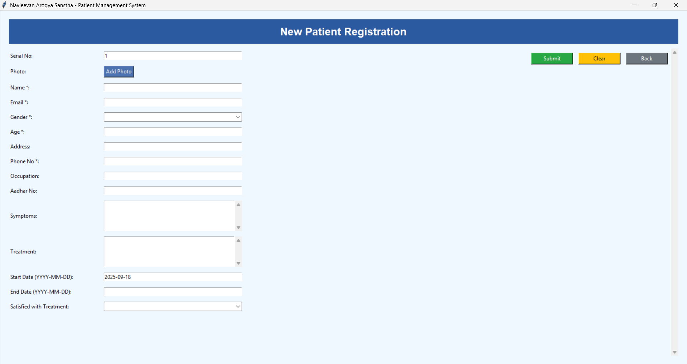
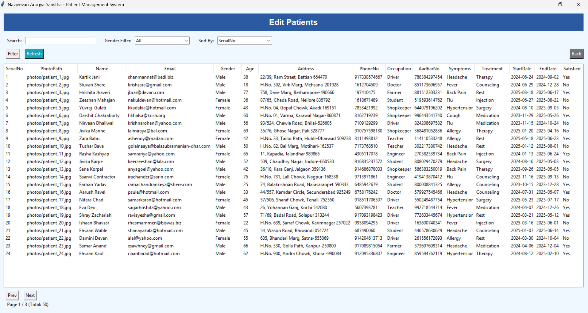
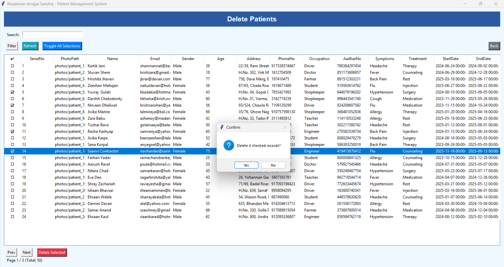
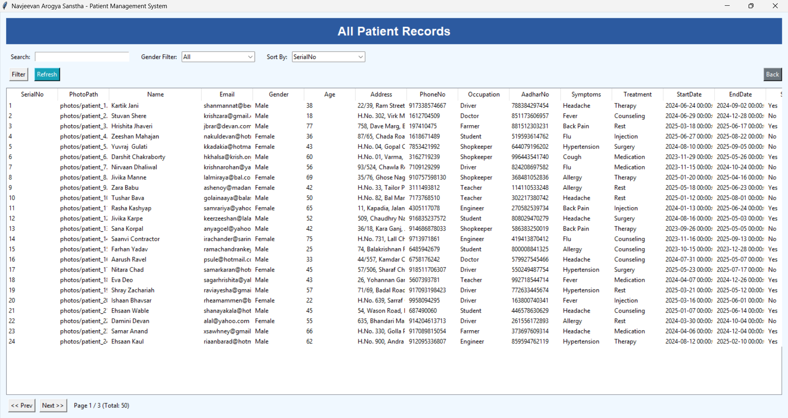
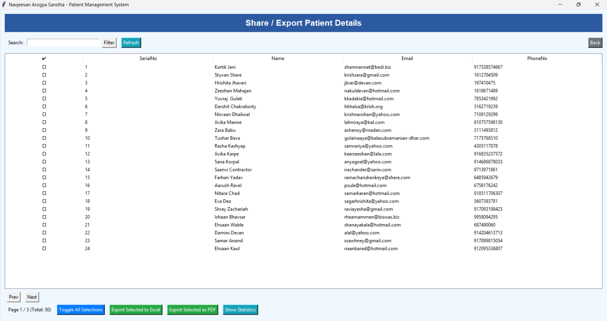
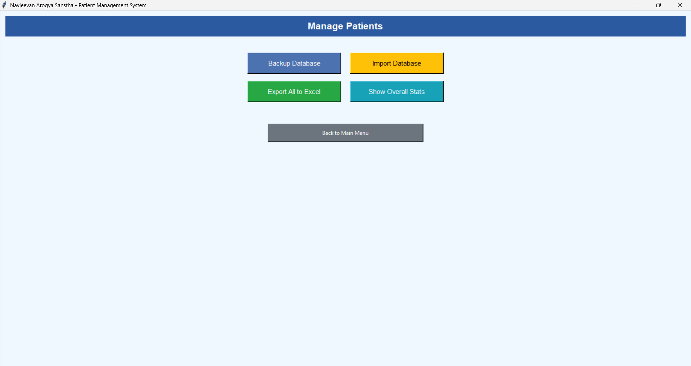

---

# 🏥 Navjeevan Arogya Sanstha - Patient Management System (NAS-PMS)

## 1. 📖 Introduction & Overview

The **Navjeevan Arogya Sanstha - Patient Management System (NAS-PMS)** is a comprehensive, user-friendly desktop application designed to digitize and streamline the process of managing patient records.

Built with **Python**, it provides a robust solution for small to medium-sized clinics, health organizations, or individual practitioners to move away from paper-based systems.

The app serves as a central database for patient information (personal details, medical history, symptoms, treatments, and reports). It runs as a standalone **Windows executable (`.exe`)**, requiring no technical expertise for installation.

---

## 2. 👥 Target Audience & Uses

This application is designed for healthcare professionals and administrative staff in clinical settings.

### ✅ Key Uses:

* 📑 **Digitize Records:** → Replace bulky and inefficient paper files with a secure and organized digital system.
* 🗂️ **Centralized Database:** → Store all patient information in a single, easily accessible location (`patients.xlsx`).
* 🔎 **Quick Search & Retrieval:** → Instantly find any patient record using a powerful search and filtering system.
* 📊 **Data Analysis:** → Gain insights into patient demographics and health trends using built-in statistical tools.
* 📝 **Professional Reporting:** → Generate and export detailed patient reports as formatted PDFs or Excel sheets for sharing or archiving.
* 💾 **Data Portability & Backup:** → Easily back up the entire patient database with a single click and import data from other sources.

---

## 3. 🛠️ Core Technologies

The application is built using a combination of powerful and standard Python libraries:

* **GUI Framework (Tkinter):** → The entire graphical user interface, including windows, buttons, forms, and tables, is built with Python's native Tkinter library.
* **Data Manipulation (Pandas):** → The powerful Pandas library is used as the backbone for all data operations. It reads, writes, filters, and sorts the data from the `patients.xlsx` file, acting as the application's database engine.
* **Image Handling (Pillow):** → Used for processing and displaying patient photographs within the application.
* **PDF Generation (ReportLab):** → Enables the creation of professional, multi-page PDF documents for patient reports.
* **Application Packaging (PyInstaller):** → Used to bundle the Python script and all its dependencies into a single standalone executable (`.exe`) file for easy distribution and use on Windows PCs.

---

## 4. 🚀 Features in Detail

#### ➕ New Patient Registration
This screen provides a comprehensive form to add a new patient to the system.
* **Auto-Generated Serial No:** → The system automatically suggests the next available `SerialNo`, which can be overridden if needed.
* **Complete Data Entry:** → Fields are available for all essential information, including Name, Email, Age, Gender, Address, Phone, Aadhar No, Occupation, Symptoms, and Treatment details.
* **Photo Upload:** → A dedicated button allows you to upload a patient's photograph from your computer. The photo is automatically saved and linked to the patient's record.
* **Date Fields:** → Start and End dates for treatment can be recorded, with the Start Date defaulting to the current day.
* **Input Validation:** → The system checks that required fields (marked with `*`) are filled and that the `Age` is a valid number.

#### ✏️ Edit Patients
This module allows for the modification of existing patient records.
* **Dynamic List View:** → Displays all patients in a paginated table.
* **Powerful Filtering:** → You can instantly filter the list by **searching for any text** (e.g., name, symptom, address) or by selecting a **Gender**. You can also **sort** → the records by Serial No, Name, Age, etc.
* **Easy Editing:** → Simply **double-click** any patient record in the list to open a pre-filled editor window where you can update any detail, including changing or removing the patient's photo.

#### 🗑️ Delete Patients
This screen provides a safe and efficient way to remove one or more patient records.
* **Checkbox Selection:** Each patient is listed with a checkbox, allowing you to select multiple records for deletion.
* **Toggle All Selections:** A convenient button lets you select or deselect all visible patients on the current page at once.
* **Confirmation Prompt:** To prevent accidental data loss, the system will ask for confirmation before permanently deleting the selected records.

#### 📋 View All Records
A read-only interface for reviewing patient details without the risk of accidental edits.
* **Full Record View:** → Double-clicking a patient in the list opens a detailed pop-up window displaying all their information in a clean, readable format, along with their photo.
* **Export & View Photo:** → From the detail view, you can export that specific patient's record to a PDF or open their photo in your computer's default image viewer.

#### 📤 Share / Export Details
This powerful module is designed for reporting and data analysis on a subset of patients.
* **Selective Export:** → Use the search bar and checkboxes to select specific patients.
* **Export to Excel:** → Creates a `.xlsx` file containing the full records of only the selected patients.
* **Export to PDF:** → Generates a professional, multi-page PDF report where each selected patient's details and photo are presented on a separate page.
* **Show Statistics:** → Provides an instant statistical summary (total count, gender breakdown, average age, etc.) for only the patients you have selected.

#### ⚙️ Manage Patients
This is the administrative control panel for managing the entire database.
* **Backup Database:** → Creates a timestamped backup copy of the `patients.xlsx` file in the application's directory, safeguarding your data.
* **Import Database:** → Allows you to import patient records from another Excel file. The system is smart enough to automatically assign new, non-conflicting serial numbers to the imported records.
* **Export All to Excel:** → Exports the *entire* patient database to a single Excel file.
* **Show Overall Stats:** → Displays a statistical summary for all patients in the database.

#### 🔍 Manage Duplicates
* **Smart Detection:** → The system automatically identifies potential duplicate records based on key identifiers like **Name, Email, Phone Number, and Aadhar Number**.
* **Review Interface:** → All potential duplicate sets are displayed together in a list for easy review.
* **Edit Serial No:** → If two different patients have the same `SerialNo`, you can **double-click the serial number** → in the list to edit and correct it on the spot.
* **Delete Duplicates:** → For true duplicates, you can select the incorrect entry with a checkbox and delete it.
* **Mark as Not Duplicate:** → If the system flags records that are not actual duplicates, you can select them and click this button to hide them from the duplicate view.

---

## 📂 Project Structure

```
Patient-App-Project/
│── patients.xlsx        # Main database (Excel file)
│── main.py              # Entry point of the application
│── screenshots/         # Images, icons, and resources
│── photos               # Patient photos uploaded in the app
│── README.md            # Documentation
│── .gitignore           # Git ignore rules
│── LICENSE              # Open-source license
```

---

## 📦 Installation & Setup

1. Clone this repo:

   ```bash
   git clone https://github.com/<your-username>/Patient-App-Project.git
   cd Patient-App-Project
   ```
2. Install dependencies:

   ```bash
   pip install pandas pillow reportlab
   ```
3. Run the app:

   ```bash
   python main.py
   ```
4. (Optional) Build `.exe` with PyInstaller:

   ```bash
   pyinstaller --onefile --windowed main.py
   ```

---

## 📸 Screenshots 

## 📸 Screenshots

### 🏠 Home Screen


### ➕ New Patient Registration


### ✏️ Edit Patients


### 🗑️ Delete Patients


### 📋 All Patient Records


### 📤 Share / Export Patient Details


### ⚙️ Manage Patients



---

## 🤝 Contribution

Contributions are welcome!

* Fork the repo
* Create a feature branch
* Submit a Pull Request

---

## 📜 License

This project is licensed under the **MIT License** – free to use and modify with attribution.

---
